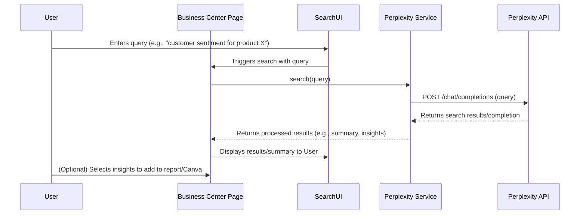

# Business Center Suite: Development Plan

This document outlines the plan for developing the Business Center suite, a comprehensive business intelligence addon for the email assistant application. It integrates Perplexity AI for search and research, and Canva for document/presentation creation.

## Revised Phased Plan (Accelerated Dashboards & Custom Widgets)

**Phase 1 (Combined): Core Setup, Perplexity Integration, Foundational Dashboards/Reports, and Custom Widgets**

1.  **Create Business Center Module:**
    *   Add route (`/business-center`), main page component (`BusinessCenterPage.jsx`), and navigation link.
2.  **Develop Perplexity Service:**
    *   Create `PerplexityService.ts` with API calling logic and secure key management.
3.  **Basic Search UI & Data Processing:**
    *   Implement a search input in `BusinessCenterPage.jsx`.
    *   Develop components to parse, summarize, and extract insights from Perplexity results.
    *   Create reusable card/widget components for displaying insights.
4.  **Implement Foundational Dashboards:**
    *   Create initial dashboard components (e.g., `IndustryNewsDashboard.jsx`, `EmailContextDashboard.jsx`).
    *   Integrate `PerplexityService` to fetch data.
    *   Display processed data using the new display components.
5.  **Implement Foundational Reports:**
    *   Create initial report generation components (e.g., `ProductResearchReport.jsx`).
    *   Use `PerplexityService` for data gathering and summarization.
    *   Present reports in a structured format.
6.  **Introduce Basic Visualization:**
    *   Integrate a charting library.
    *   Add basic charts to relevant initial dashboards.
7.  **Develop Customizable Widget System:**
    *   Allow users to define and save custom Perplexity search queries (e.g., in a dedicated "Add Widget" modal/form).
    *   Implement storage for user-defined widgets (e.g., using local storage for simplicity in this phase).
    *   Create a customizable dashboard grid layout (e.g., using a library like `react-grid-layout`).
    *   Render saved widgets on the grid, fetching and displaying data from Perplexity based on their saved query.

**Phase 2: Advanced Dashboards & Data Refinement**

1.  **Implement Remaining Dashboards:**
    *   Build components for Market Trends, Competitor Analysis dashboards, incorporating more advanced visualizations.
2.  **Refine Data Handling & Optimization:**
    *   Improve summarization/insight extraction accuracy.
    *   Optimize Perplexity API usage (caching, query refinement).
    *   Potentially move widget storage from local storage to a more persistent solution if needed.

**Phase 3: Canva Integration**

*   **Note:** Dependent on Canva API feasibility confirmation.
1.  **Research & Setup:** Investigate Canva developer docs, set up developer account/app.
2.  **Authentication:** Implement Canva OAuth flow.
3.  **Data to Canva Templates:** Develop functionality to send Perplexity insights to Canva templates.
4.  **Embed Canva Editor:** Integrate the Canva Apps SDK.
5.  **Link/Embed Existing Designs:** Allow linking/embedding existing Canva designs.

**Phase 4: Refinement & Testing**

1.  **UI/UX Polish:** Improve overall look, feel, and usability, especially for the customizable dashboard.
2.  **Error Handling:** Enhance error handling for all integrations and components.
3.  **Performance Optimization:** Optimize rendering, API calls, data processing.
4.  **Testing:** Comprehensive unit, integration, and end-to-end testing.

---

## High-Level Architecture Diagram

```mermaid
graph TD
    subgraph Frontend (React)
        subgraph Business Center Module (/business-center)
            BCPage[BusinessCenterPage.jsx]
            subgraph Dashboards
                MarketTrends[...]
                CompetitorAnalysis[...]
                IndustryNews[...]
                EmailContext[...]
                CustomWidgets[...]
            end
            subgraph Reports
                ProductResearch[...]
                CustomerSentiment[...]
                MarketOpportunities[...]
            end
            subgraph Canva Integration
                CanvaEmbed[Embedded Editor]
                CanvaLink[Link/Embed Existing]
            end
            SearchUI[Search Input/Results]
        end
        Sidebar[Sidebar/Navigation]
        Services[Services Layer]
        UIComponents[Shared UI Components]
    end

    subgraph Services Layer
        PerplexitySvc[PerplexityService.ts]
        CanvaSvc[CanvaService.ts (Handles Canva API calls)]
        AuthSvc[AuthService (Handles Canva OAuth)]
        ExistingSvcs[...]
    end

    subgraph External APIs
        PerplexityAPI[Perplexity AI API]
        CanvaAPI[Canva Apps SDK / Connect API]
    end

    Sidebar --> BCPage
    BCPage --> SearchUI
    BCPage --> Dashboards
    BCPage --> Reports
    BCPage --> Canva Integration

    SearchUI --> Services
    Dashboards --> Services
    Reports --> Services
    Canva Integration --> Services

    Services --> PerplexitySvc
    Services --> CanvaSvc
    Services --> AuthSvc

    PerplexitySvc --> PerplexityAPI
    CanvaSvc --> CanvaAPI
    AuthSvc --> CanvaAPI
```

---

## Example Workflow: Perplexity Search for Report



---

## Considerations

1.  **Canva API Feasibility:** The Canva integration's feasibility, especially embedding the editor and sending data to templates, needs confirmation by reviewing their latest developer documentation. This might impact the scope of Phase 3.
2.  **API Keys:** Ensure secure handling of both Perplexity and potentially Canva API keys/secrets using environment variables and appropriate backend/frontend practices.
3.  **State Management:** Decide on a state management approach for the Business Center (e.g., component state, Context API, or a library like Zustand/Redux if already used).
4.  **Backend:** This plan assumes a primarily frontend implementation. If complex data storage (e.g., persisting user widgets beyond local storage) or server-side processing is needed, a backend component might be required later.